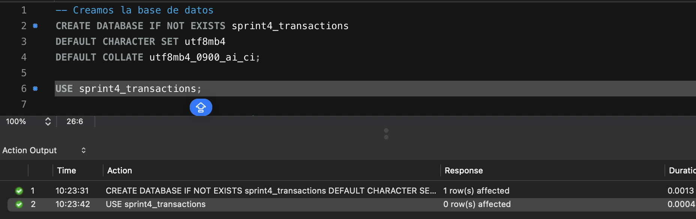

# Sprint_4 Michela Vistarini

> Creación y diseño de una Base de Datos con SQL
> 

# Nivel 1

El modelo propuesto para el marketplace sigue una estructura en estrella. Se ha definido la tabla **`transactions`** como la tabla de hechos del modelo, ya que en ella se registran las transacciones diarias realizadas en el marketplace.

El resto de tablas —**`american_users`**, **`european_users`**, **`credit_cards`**, **`companies`** y **`products`**— se consideran tablas de dimensiones, puesto que aportan información descriptiva y atributos adicionales que enriquecen el análisis. Sin embargo, las principales métricas de negocio se concentran en la tabla transactions, que actúa como eje central del modelo.

Para la creación de las tablas, se ha optado por ajustar directamente la longitud de los campos **VARCHAR** para optimizar el almacenamiento y asignar a cada atributo el tipo de dato más adecuado según su contenido.

Tanto el campo **`user_id`** de la tabla **`transactions`** como el **`id`** de la tabla **`user`** se ha mantenido como texto para evitar la pérdida de posibles ceros a la izquierda.

Las modificaciones de tipos de dato se han realizado durante la importación con **`SET`**

Proceso de creación:

<aside>

Se han renombrado algunos campos para adaptarlos a una nomenclatura más habitual y cómoda de usar en el entorno de trabajo.

</aside>

Dado que la información de **`users`** estaba dividida en dos archivos en función de su origen, en el modelo final se ha decidido consolidarla en una sola tabla y añadir un campo adicional para indicar la región de origen de cada registro.

Tablas creadas en el modelo:

Creamos las conexiones entre dimensiones y tabla de hechos:

Modelo resultante:

Por último se añade la última tabla del modelo: **`products`**

En la tabla de hechos **`transactions`** se observa que **`products_ids`** contiene una lista de valores separada por comas, no un único valor por celda. Esto indica que una misma transacción puede incluir varios productos.

Para facilitar futuras consultas, conviene normalizar este campo en una **tabla intermedia**, donde cada fila relacione una transacción con un producto. Así se resuelve la relación **muchos a muchos (M:N)** y se simplifican los **JOIN** con la tabla de productos.

**MODELO FINAL**

El modelo final podría decirse que no se trata de un esquema en estrella puro, sino de un modelo dimensional que incorpora una tabla puente. Por su estructura, presenta una organización más próxima a un esquema snowflake que a una estrella clásica ya que incorpora una tabla puente.

**Ejercicio 1.1 Usuarios con más de 80 transacciones**

**Ejercicio 1.2 Media de amount por `iban` de las tarjetas de la compañía Donec Ltd.**

# Nivel 2

**Ejercicio 2.1 Crea una nueva tabla que refleje el estado de las tarjetas de crédito: si las tres últimas transacciones han sido rechazadas, la tarjeta se considerará inactiva; si al menos una de ellas no ha sido rechazada, se considerará activa. A partir de esta tabla, responde:**

**¿Cuántas tarjetas están activas?**

# Nivel 3

**Ejercicio 3.1 Necesitamos conocer el número de veces que se ha vendido cada producto.**

